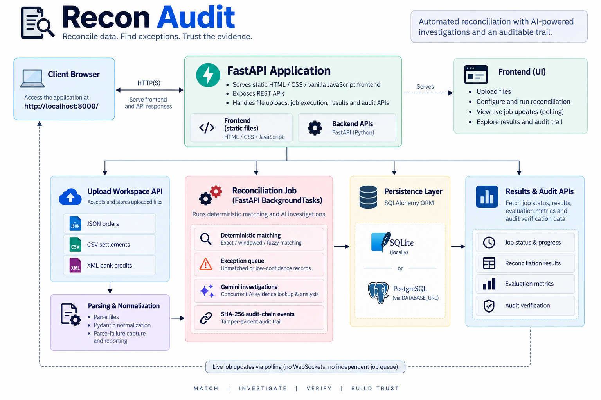

# ReconAudit — AI Finance Controller & Reconciliation Pipeline

ReconAudit is an end-to-end finance reconciliation application for comparing orders, payment settlements, and bank credits. It turns separate source files into explainable reconciliation results in a browser dashboard.

I built it as a portfolio project for finance operations, accounting automation, and AI-agent workflow roles. Its focus is multi-source data integration, deterministic financial controls, evidence-grounded AI investigation, persistent auditability, and an honest exception queue.

---

## Problem Statement

Finance teams often verify that an order was settled by a payment processor and eventually received as a bank credit. The records originate from separate systems and are frequently checked manually.

ReconAudit brings those sources together and:

1. **Ingests** uploaded JSON, CSV, and XML source files
2. **Validates and normalizes** records, retaining malformed rows as explicit parse failures
3. **Matches** order, settlement, and bank records through deterministic exact, time-window, and fuzzy rules
4. **Investigates** exceptions using a Gemini function-calling agent and bounded, application-provided evidence tools
5. **Stores** batches, records, runs, exceptions, agent outcomes, and audit events through SQLAlchemy
6. **Surfaces** grouped exceptions, plain-language explanations, CSV export, and audit verification in a browser dashboard

The application does not claim an automatic answer for every record. When the available evidence is insufficient, it returns **Needs your review** instead of force-matching a transaction.

---

## Architecture



The frontend is served from the FastAPI application at `http://localhost:8000/`. Live job updates use polling of the reconciliation-job endpoint; there is no WebSocket server or independent job queue.

---

## Tech Stack

| Layer | Tool |
|---|---|
| API and application server | Python, FastAPI, Uvicorn |
| Validation and schema | Pydantic |
| File parsing | Pandas, `xmltodict`, Python JSON handling |
| Matching | Python `Decimal`, RapidFuzz |
| AI investigation | Google Gen AI SDK (`google-genai`), Gemini native function calling |
| Persistence | SQLAlchemy 2.x |
| Local database | SQLite |
| Production database option | PostgreSQL through `psycopg` and `DATABASE_URL` |
| Frontend | HTML, CSS, vanilla JavaScript |
| Audit integrity | Custom SHA-256 linked hash chain |
| Deployment scaffolding | Docker Compose, AWS SAM/Mangum |

---

## Database Schema

The SQLAlchemy entities are defined in [`backend/app/db/models.py`](backend/app/db/models.py).

- **`ingestion_batches`**: one row per client upload workspace or reconciliation batch
- **`uploaded_files`**: source name, source type, accepted-row count, and failed-row count
- **`parse_failures`**: source row, original payload, and parsing error for rows that could not be normalized
- **`normalized_transactions`**: canonical transactions with source, amount, currency, timestamp, and original payload
- **`reconciliation_runs`**: completed run result and evaluation payload
- **`match_results`**: deterministic match or exception result and applied rule
- **`exceptions`**: detected exception type and its result payload
- **`agent_resolutions`**: agent outcome, root-cause category, and evidence payload
- **`audit_ledger`**: event records containing each predecessor hash and SHA-256 record hash

SQLite is used when `DATABASE_URL` is not configured. A managed PostgreSQL connection URL can be supplied for deployment.

---

## Reconciliation Logic

The matching engine in [`backend/app/matching/engine.py`](backend/app/matching/engine.py) applies these implemented tiers:

| Tier | Rule currently implemented |
|---|---|
| Exact | Groups records by reference. Order, settlement, and bank credit must have equal amount and currency; bank-credit timing above two days is flagged as a timing anomaly. |
| Windowed | For an unmatched order, seeks unused settlement and bank records with equal amount/currency within two days of the order timestamp. |
| Fuzzy | For an unmatched order, seeks unused records with the same currency, amount difference no greater than `0.01`, and RapidFuzz reference/counterparty score of at least `85`. |

The engine produces: `MISSING_SETTLEMENT`, `MISSING_BANK_CREDIT`, `AMOUNT_MISMATCH`, `TIMING_ANOMALY`, `DUPLICATE_TRANSACTION`, and `ORPHAN_RECORD` exceptions.

---

## Gemini Agent and Guardrails

Deterministic code performs financial matching and exception detection. Gemini is used only after an exception is flagged, to select evidence-gathering actions and produce a conclusion from the returned results.

The function-calling loop uses `gemini-3.6-flash` and can invoke these application-owned tools:

- `lookup_record` — retrieve a transaction by ID
- `search_related_transactions` — retrieve transactions sharing a reference
- `check_timing_window` — compare two transaction timestamps
- `compare_amounts` — compare two transaction amounts

Each exception has a configurable step budget, defaulting to four calls. The grounding validation in [`backend/app/agent/guardrails.py`](backend/app/agent/guardrails.py) requires a valid root-cause category, cited fields, and citations present in the tool trace. Otherwise the outcome becomes `ABSTAINED`.

Missing-bank-credit cases with no independently observed bank record are also forced to abstain. The dashboard labels this outcome **Needs your review**.

---

## Data Quality Handling

The upload parser in [`backend/app/ingestion/parsers.py`](backend/app/ingestion/parsers.py) validates each source record independently:

| Source | File format | Required normalized values |
|---|---|---|
| Orders | JSON | `id`, `amount`, `currency`, `created_at` |
| Settlements | CSV | `id`, `amount`, `currency`, `settled_at` |
| Bank credits | XML | `id`, `amount`, `currency`, `credited_at` |

| Issue | Current handling |
|---|---|
| Missing or invalid required field | Reports the row as a parse failure with its original payload and error text. |
| Invalid date or amount conversion | Reports the row as a parse failure. |
| Duplicate ID within one uploaded file | Retains the later duplicate as a parse failure; accepts only the first row. |
| Re-upload of one source type | Intentionally replaces existing records, file metadata, and parse failures for that source. |

Client uploads do not receive invented accuracy scores. Precision, recall, F1, and related accuracy measures are calculated only for the synthetic demo, which has a separate `ground_truth.json` answer key.

---

## Setup and Running Locally

### 1. Prerequisites

- Python 3.11 or newer
- A Gemini API key for live Gemini investigations
- No database credential for the default SQLite setup

### 2. Install dependencies

```powershell
cd backend
py -3.11 -m venv .venv
.\.venv\Scripts\Activate.ps1
py -m pip install -r requirements.txt
```

### 3. Configure environment

From the project root:

```powershell
Copy-Item .env.example .env
```

Edit `.env`:

```dotenv
GEMINI_API_KEY=your_gemini_api_key_here
DATABASE_URL=sqlite:///./recon_audit.db
AGENT_STEP_BUDGET=4
AGENT_MAX_CONCURRENCY=4
```

`GEMINI_API_KEY` is the only Gemini credential. The default SQLite database does not need a username or password. Use a PostgreSQL URL in `DATABASE_URL` for PostgreSQL deployments.

### 4. Start the application

```powershell
cd backend
.\.venv\Scripts\Activate.ps1
uvicorn app.main:app --reload
```

Open [http://localhost:8000/](http://localhost:8000/) in a browser. API documentation is available at [http://localhost:8000/docs](http://localhost:8000/docs).

### 5. Upload and reconcile data

1. Create a workspace in the dashboard.
2. Upload Orders, Settlements, and Bank Credits files.
3. Review accepted rows and parse-failure messages.
4. Start reconciliation and follow the live status panel.
5. Review results grouped by exception type.
6. Export the exception table to CSV, if required.
7. Verify the audit ledger from the results page.

### 6. Run the synthetic demo

Use **Run synthetic demo** in the dashboard. It generates a fixed 60-record batch, reconciles it, and evaluates it against the separate ground-truth file. That answer key is used for evaluation only, not as agent evidence.

### 7. Run tests

```powershell
cd backend
py -m pytest
```

---

## Project Structure

```text
Recon-Audit/
├── backend/
│   ├── app/
│   │   ├── agent/               # Gemini provider, tool schemas, guardrails
│   │   ├── audit_ledger/        # SHA-256 hash-chain implementation
│   │   ├── core/                # environment configuration
│   │   ├── db/                  # SQLAlchemy session and models
│   │   ├── evaluation/          # synthetic-demo metrics
│   │   ├── ingestion/           # schemas and JSON/CSV/XML parsers
│   │   ├── matching/            # deterministic matching engine
│   │   ├── synthetic_data/      # reproducible demo generator
│   │   ├── main.py              # FastAPI endpoints and frontend hosting
│   │   └── services.py          # orchestration and persistence
│   └── requirements.txt
├── frontend/                    # upload, status, and results UI
├── infra/                       # seed data, SAM template, Docker Compose
├── scripts/                     # utility and product-demo assembly scripts
├── .env.example
└── README.md
```

---

## Current Limitations and Future Improvements

The following are not currently independent production services:

- **Durable distributed job queue:** Job progress is held in FastAPI process memory and a restart loses active job status.
- **Multi-instance coordination:** There is no Redis, Celery, SQS, or equivalent worker queue.
- **Authentication and RBAC:** The local app has no implemented user authentication or finance-role permissions.
- **Production CORS policy:** Local development allows all origins and needs a restrictive deployment configuration.
- **Broad CI/CD and end-to-end coverage:** Tests exist, but a complete CI/CD pipeline and full e2e suite are not present.
- **Production file security:** Real client uploads require TLS, authenticated access, encrypted storage, retention controls, and secret management outside `.env`.

---

## Author’s Note

ReconAudit demonstrates a complete reconciliation workflow: file ingestion, validation, normalization, deterministic matching, AI-assisted exception investigation, persistence, evaluation, human-review abstention, and audit verification. The design treats AI as an evidence investigator rather than a replacement for financial controls, so it can communicate both what it can explain and what still requires finance-professional review.
